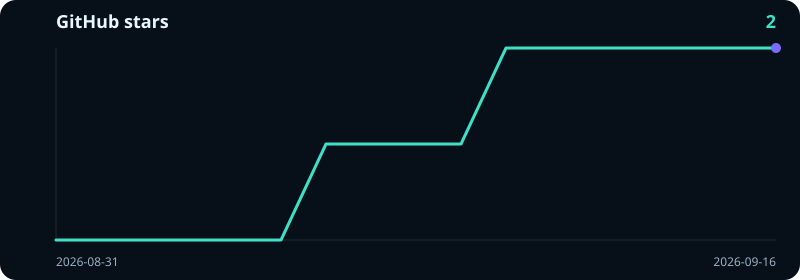

# FreeDeepseekAPI

<p align="center">
  <strong>Local OpenAI-compatible API proxy for DeepSeek Web Chat</strong>
</p>

<p align="center">
  <a href="https://github.com/dekrezz/FreeDeepseekAPI/blob/main/LICENSE"></a>
  
  
  
  
</p>

<p align="center">
  <strong>English</strong> ·
  <a href="README.ru.md">Русский</a> ·
  <a href="README.zh.md">简体中文</a>
</p>

<p align="center">
  <a href="#quick-start">Quick start</a> •
  <a href="#what-you-get">What you get</a> •
  <a href="#request-examples">Examples</a> •
  <a href="#models">Models</a> •
  <a href="#endpoints">Endpoints</a> •
  <a href="#open-webui">Open WebUI</a> •
  <a href="#coding-agents">Coding agents</a>
</p>

FreeDeepseekAPI runs a local API server in front of **DeepSeek Web Chat** ([chat.deepseek.com](https://chat.deepseek.com)). Point Open WebUI, LiteLLM, Hermes, Claude Code, Codex, OpenCode, OpenClaw, Cursor, or any OpenAI-compatible client at it.

The project uses your normal logged-in DeepSeek account. The local server accepts API requests, then continues that saved Web session. There is no paid `api.deepseek.com` key.

One model is on the site today: **DeepSeek-V4.1-Flash**. `-thinking` turns DeepThink on. `-search` turns on the native Web Search built into chat.deepseek.com, and that search is what answers live internet questions.

> This is an experimental Web-chat proxy. DeepSeek can change the private Web API without notice. For a production workload, use the official paid DeepSeek API.

---

## Contents

- [What you get](#what-you-get)
- [Features](#features)
- [Quick start](#quick-start)
- [Windows](#windows)
- [Linux / Chromium](#linux--chromium)
- [VPS / headless](#vps--headless)
- [Rootless Podman](#rootless-podman)
- [Diagnostics / doctor](#diagnostics--doctor)
- [Session reuse](#session-reuse)
- [Multi-account pool](#multi-account-pool)
- [Sign-in](#sign-in)
- [Coding agents](#coding-agents)
- [Check that it works](#check-that-it-works)
- [Request examples](#request-examples)
  - [Chat Completions](#chat-completions)
  - [DeepThink](#deepthink)
  - [Native web search](#native-web-search)
  - [Streaming](#streaming)
  - [Anthropic Messages](#anthropic-messages)
  - [OpenAI Responses](#openai-responses)
  - [Tool calling](#tool-calling)
  - [Images](#images)
- [Models](#models)
- [Endpoints](#endpoints)
- [Environment](#environment)
- [Errors](#errors)
- [Open WebUI](#open-webui)
- [Refresh the login](#refresh-the-login)
- [Tests](#tests)
- [Project status](#project-status)

---

## What you get

- Use DeepSeek Web as a local API endpoint.
- Connect DeepSeek to Open WebUI and other OpenAI-compatible clients.
- Get a normal JSON body or a streaming SSE response.
- Turn DeepThink on with `-thinking` and read `reasoning_content`.
- Talk to Claude Code through the Anthropic Messages shim.
- Talk to Codex through the OpenAI Responses shim.
- Keep a separate Web chat for each agent or `user` id.
- Let several local tools run in one reply, up to eight.
- Search the live web with DeepSeek's own search, not with bash or a harness websearch tool.

## Features

- **OpenAI-compatible API:** `POST /v1/chat/completions`
- **Anthropic-compatible shim:** `POST /v1/messages`
- **OpenAI Responses shim:** `POST /v1/responses`
- **Streaming:** SSE chunks, and a normal non-stream JSON body
- **DeepThink:** `reasoning_content` when `-thinking` is on
- **Native search:** chat.deepseek.com Web Search when `-search` is on, and also whenever a coding agent sends local tools
- **Tool calling:** OpenAI tools, Anthropic tools, and Responses function tools, returned as a batch
- **Model capabilities:** `GET /v1/model-capabilities`
- **Agent sessions:** one DeepSeek chat per `x-agent-session` or `user`
- **Session recovery:** an empty reply, a broken tool call, or a timeout keeps the same chat
- **Zero dependencies:** Node.js 18+, no npm packages
- **License:** Apache-2.0

---

## Quick start

```bash
git clone https://github.com/dekrezz/FreeDeepseekAPI.git
cd FreeDeepseekAPI
npm run auth
npm start
```

`npm run auth` opens the sign-in menu. Choose Chrome sign-in, log in at chat.deepseek.com in the profile it opens, send a short message such as `ok`, then return to the terminal and continue. The saved file is `deepseek-auth.json`, mode `0600`.

`npm start` opens the launch menu:

- Start proxy
- Sign in with Chrome
- Import an auth file or a browser cookie export
- Show the DeepSeek-V4.1-Flash model ids
- Quit

Headless or CI, with no menu:

```bash
NON_INTERACTIVE=1 npm start
# or
SKIP_ACCOUNT_MENU=1 npm start
```

The server listens on:

```text
http://127.0.0.1:9655
```

By default only this computer can reach it. To publish it on a network, set an address and a proxy key:

```bash
HOST=0.0.0.0 PROXY_API_KEY='replace-with-a-long-random-value' npm start
```

Send that key as `Authorization: Bearer <key>`. Without `PROXY_API_KEY`, the API has no authentication of its own. Do not put that instance on a network.

Browser calls are allowed from loopback origins. If the UI is on another origin, list the exact origins, comma-separated:

```bash
PROXY_CORS_ORIGINS='https://ui.example.com,http://192.168.1.20:3000'
```

---

## Windows

```powershell
git clone https://github.com/dekrezz/FreeDeepseekAPI.git
cd FreeDeepseekAPI
npm run auth
npm start
```

If Chrome is not in the usual place:

```powershell
$env:CHROME_PATH="C:\Program Files\Google\Chrome\Application\chrome.exe"
npm run auth
```

When Chrome is missing, `npm run auth` prints the install path for Windows, macOS, or Linux instead of a raw stack trace.

---

## Linux / Chromium

```bash
git clone https://github.com/dekrezz/FreeDeepseekAPI.git
cd FreeDeepseekAPI
CHROME_PATH=$(which chromium) npm run auth
npm start
```

If the binary has another name:

```bash
CHROME_PATH=$(which chromium-browser) npm run auth
# or
CHROME_PATH=$(which google-chrome) npm run auth
```

---

## VPS / headless

The reliable path does not run Chrome on the server.

1. On a machine that has a GUI and Chrome:

```bash
npm run auth
```

2. Copy `deepseek-auth.json` to the VPS:

```bash
scp deepseek-auth.json user@your-vps:/opt/FreeDeepseekAPI/deepseek-auth.json
```

3. Import it and check the file:

```bash
cd /opt/FreeDeepseekAPI
npm run auth:import -- --input ./deepseek-auth.json
npm run doctor -- --offline
```

4. Start the proxy with no menu:

```bash
NON_INTERACTIVE=1 npm start
```

A browser cookie export works too, if you also have the token:

```bash
DEEPSEEK_TOKEN="<token>" npm run auth:import -- --input ./cookies.json
```

`deepseek-auth.json` is access to your DeepSeek Web login. Do not commit it, do not paste it into a chat, and keep it mode `0600`.

There is no password login command. The proxy never asks for your DeepSeek password and never stores one. Sign-in is Chrome, a saved auth file, or a cookie export plus token.

---

## Rootless Podman

The container only runs the proxy. Sign in on the host with `npm run auth`. Auth scripts and `deepseek-auth.json` are not copied into the image.

Run Podman as your user, not as root.

1. Build the image:

```bash
podman build --tag localhost/free-deepseek-api:local --file Containerfile .
```

2. Store the DeepSeek auth file and a separate proxy key as secrets:

```bash
podman secret create --replace free-deepseek-auth ./deepseek-auth.json

printf 'Proxy API key: '
IFS= read -r -s PROXY_API_KEY
printf '\n'
printf '%s' "$PROXY_API_KEY" |
  podman secret create --replace free-deepseek-proxy-key -
```

Use a long random key. The value stays in this shell so you can call the API. It is not baked into the image or the Podman command line.

3. Start the container with the privileges dropped:

```bash
podman run --detach \
  --name free-deepseek-api \
  --publish 127.0.0.1:9655:9655 \
  --secret free-deepseek-auth,type=mount,target=/run/secrets/deepseek-auth.json,mode=0400 \
  --secret free-deepseek-proxy-key,type=mount,target=/run/secrets/proxy-api-key,mode=0400 \
  --read-only \
  --cap-drop=ALL \
  --security-opt=no-new-privileges \
  localhost/free-deepseek-api:local
```

Inside the image, `NON_INTERACTIVE=1`, `HOST=0.0.0.0`, and `REQUIRE_PROXY_API_KEY=1` are already set. The container refuses to serve if the proxy-key secret is missing or empty. On the host the port is published only on `127.0.0.1`. Do not drop that address unless you have a firewall in front of it.

4. Check liveness, account readiness, and the protected model list:

```bash
podman healthcheck run free-deepseek-api
curl --fail http://127.0.0.1:9655/readyz
curl --fail \
  -H "Authorization: Bearer $PROXY_API_KEY" \
  http://127.0.0.1:9655/v1/models
```

The built-in healthcheck hits local `/health` and only tells you the process is up. `/readyz` returns `503` when no DeepSeek login can serve a chat right now.

```bash
podman logs free-deepseek-api
podman inspect --format '{{.State.Health.Status}}' free-deepseek-api
```

Stop the container and remove the secrets:

```bash
podman stop free-deepseek-api
podman rm free-deepseek-api
podman secret rm free-deepseek-auth free-deepseek-proxy-key
unset PROXY_API_KEY
```

When you rotate the login or the proxy key, replace the secret and recreate the container.

---

## Diagnostics / doctor

```bash
npm run doctor
# no network call to DeepSeek:
npm run doctor -- --offline
```

`doctor` checks:

- whether `deepseek-auth.json` or `DEEPSEEK_AUTH_DIR` is present;
- whether the JSON parses;
- whether `token`, `cookie`, and `wasmUrl` are set;
- whether the file mode is `0600` on macOS and Linux;
- on a normal run, whether the DeepSeek PoW endpoint answers.

If you see `data.biz_data is null`, `fetch failed`, `401`, `403`, `429`, or a coding agent that cannot list models, run `npm run doctor` first.

---

## Session reuse

FreeDeepseekAPI does not open a new DeepSeek chat on every HTTP request.

- One `x-agent-session`, `session`, or `user` value is one DeepSeek chat.
- When that chat already exists, the proxy continues it with `parent_message_id`.
- The standing system prompt and the tool list go upstream **once**. Later turns from OpenCode, Claude Code, and Codex send only the new user or tool turn.
- A changed system prompt is sent again.
- An empty reply, a broken tool-call, or a timeout **keeps** the live chat. Those failures used to open a new chat and resend the whole prompt. They do not anymore.
- A new chat starts when the session is missing, the chain hits 100 messages, the chat is older than 2 hours, DeepSeek says the prompt is too long, or you call `/reset-session`.
- Long prompts are cut to `DEEPSEEK_MAX_PROMPT_CHARS` (default 80,000 characters) before they are sent. The start of the task, the latest tool results, and the tool reminder stay.
- If the client already sent a multi-turn history, the proxy does not paste its own recovery history a second time.
- An empty reply is retried up to `DEEPSEEK_MAX_RETRIES` times (default 2). Each retry uses a smaller slice of context, still on the same chat when that chat is alive.

Set the agent explicitly:

```bash
curl -X POST http://127.0.0.1:9655/v1/chat/completions \
  -H "Content-Type: application/json" \
  -H "x-agent-session: my-agent" \
  -d '{"model":"deepseek-v4-flash","messages":[{"role":"user","content":"Hello"}]}'
```

List active sessions:

```bash
curl http://127.0.0.1:9655/v1/sessions
```

Reset one session:

```bash
curl -X POST "http://127.0.0.1:9655/reset-session?agent=my-agent"
```

Reset every session:

```bash
curl -X POST "http://127.0.0.1:9655/reset-session?agent=all"
```

You will still see chats in the DeepSeek website. The proxy uses the Web Chat API, and DeepSeek stores the real chats. Session reuse only stops the proxy from opening a new one when the current chain is still good.

A message whose text is exactly `/new` resets that agent's remote chat instead of sending the text to the model.

---

## Multi-account pool

DeepSeek can ban a login for days if two chats send on that same login at the same time. The pool rule is: one in-flight chat per login. A second request for a busy login waits. It does not overlap.

Sticky means the proxy does not hop accounts in the middle of a live chat. If the login gets `401`, `403`, or `429` and goes into cooldown, the next request can move to another ready login, and the old remote session is dropped first.

Directory of auth files:

```bash
mkdir -p accounts
npm run auth:import -- --input ~/Downloads/deepseek-auth.json --output ./accounts/worker-2.json
chmod 600 accounts/*.json deepseek-auth.json
DEEPSEEK_AUTH_DIR=./accounts NON_INTERACTIVE=1 npm start
```

Or a comma-separated list:

```bash
DEEPSEEK_AUTH_PATH="./accounts/main.json,./accounts/backup.json" NON_INTERACTIVE=1 npm start
```

How the pool behaves:

- a new agent gets a free login, round-robin;
- that login stays stuck to the session;
- `401`, `403`, and `429` put the login in cooldown (`DEEPSEEK_ACCOUNT_COOLDOWN_MS`, default 10 minutes);
- two requests and two free logins go to different accounts;
- the same `x-agent-session` overlapping waits on its login (`DEEPSEEK_ACCOUNT_LOCK_WAIT_MS`, default 120 seconds);
- when every login is busy, the request waits on the sticky or least-recently-used login;
- OpenCode's session-title request is answered locally and does not occupy a login;
- `/health` shows account status without auth-file paths or file names;
- auth files must be mode `0600`.

You cannot pin a client to a chosen file. The proxy picks a free login.

```bash
DEEPSEEK_ACCOUNT_COOLDOWN_MS=600000 npm start
```

---

## Sign-in

| Command | What it does |
|---|---|
| `npm run auth` | Menu: Chrome sign-in, import, status, delete the local file |
| `npm run deepseek:auth` | Chrome capture of token and cookies |
| `npm run auth:import` | Import `deepseek-auth.json` or a browser cookie export |
| `npm run doctor` | Check the files. Drop `--offline` to also hit PoW |

Chrome extension: load `chrome-extension/` on an open chat.deepseek.com tab. Collect until **Token** is Ready, then save the file. Do not paste that JSON into a chat.

Fields: `token`, `cookie`, `wasmUrl`. Optional: `hif_dliq`, `hif_leim`, `name`, and `enabled` (`false` pauses that login). See [`auth.example.json`](auth.example.json).

The password of the DeepSeek account is not an input. There is no `auth:console` command, and none should store a password on disk.

---

## Coding agents

```bash
npm run setup:agents
npm run setup:agents -- --all --model deepseek-v4-flash
npm run setup:agents -- --target claude-code --model deepseek-v4-flash-thinking
npm run setup:agents -- --target codex --model deepseek-v4-flash
```

The proxy must already be listening. The default origin is `http://127.0.0.1:9655`. Override it with `--base-url`. If `PROXY_API_KEY` is set, it is copied into the agent config.

Setup adds FreeDeepseekAPI as an opt-in profile. It does not replace Claude, GPT, or whatever you already use.

| Agent | What is written | How you select it |
|---|---|---|
| Claude Code | `~/.claude/freedeepseek.settings.json` | `claude --settings ~/.claude/freedeepseek.settings.json` |
| Codex | `~/.codex/freedeepseek.config.toml` and a model catalog | `codex --profile freedeepseek` |
| OpenCode | a `freedeepseek` provider, plus autonomy rules in `AGENTS.md` | pick `freedeepseek/<id>` |
| Hermes | `~/.hermes/freedeepseek.yaml` | that profile file |
| OpenClaw | a `freedeepseek` provider | pick it explicitly |
| Cursor | a snippet and launcher under `integrations/cursor/` | editor settings stay as they are |

`--model` is always DeepSeek-V4.1-Flash. `-thinking` turns DeepThink on. `-search` turns native chat.deepseek.com search on. A request that includes local tools turns that native search on even when the id has no `-search` suffix. DeepThink still follows the id you picked.

Codex setup does **not** set `forced_login_method = api`. On Codex CLI that line logs you out of ChatGPT. Normal `codex` stays on ChatGPT. The FreeDeepseek profile talks to this proxy.

Images:

- Claude Code: paste or attach. The Anthropic `image` block is uploaded to DeepSeek Web.
- Codex: `codex -i screenshot.png`. Repeat `-i` for more files. `/v1/responses` accepts `input_image`.
- OpenCode: paste or drop an image. The generated config keeps attachments.
- Other OpenAI clients: send `image_url` as a base64 data URL or a public HTTPS URL.

Restore a previous setup from its backup:

```bash
node scripts/setup-agents.js --restore ~/.freedeepseek-api/backups/<stamp>
```

Two agents at once need two Web logins in `accounts/`. Details: [docs/agents.md](docs/agents.md).

---

## Check that it works

```bash
curl http://127.0.0.1:9655/health
curl http://127.0.0.1:9655/readyz
curl http://127.0.0.1:9655/v1/models
curl http://127.0.0.1:9655/v1/model-capabilities
```

`/health` is liveness. `/readyz` is `200` only when at least one login can serve. `/v1/models` lists the four DeepSeek-V4.1-Flash ids.

---

## Request examples

### Chat Completions

```bash
curl -X POST http://127.0.0.1:9655/v1/chat/completions \
  -H "Content-Type: application/json" \
  -H "x-agent-session: my-agent" \
  -d '{
    "model": "deepseek-v4-flash",
    "messages": [{"role": "user", "content": "Answer in one sentence."}],
    "stream": false
  }'
```

### DeepThink

`-thinking` is the DeepThink switch from the chat composer. The model is still DeepSeek-V4.1-Flash. It reasons before the answer.

```bash
curl -X POST http://127.0.0.1:9655/v1/chat/completions \
  -H "Content-Type: application/json" \
  -d '{
    "model": "deepseek-v4-flash-thinking",
    "messages": [{"role": "user", "content": "Why is the sky blue? Keep it short."}],
    "stream": false
  }'
```

Where the reasoning shows up:

- non-stream: `choices[0].message.reasoning_content`
- stream: `choices[0].delta.reasoning_content`
- usage: `usage.completion_tokens_details.reasoning_tokens`

`reasoning_tokens` is an estimate from the extracted DeepThink text. The Web stream does not report official reasoning-token usage.

A tool-call turn does not attach reasoning to the message. Some agents treat any text next to a tool call as the final answer and stop.

### Native web search

`-search` turns on the native Web Search of chat.deepseek.com. Internet questions go through that search. Do not ask the model to use bash, curl, or a harness `websearch` / `webfetch` tool for the live web.

```bash
curl -X POST http://127.0.0.1:9655/v1/chat/completions \
  -H "Content-Type: application/json" \
  -d '{
    "model": "deepseek-v4-flash-search",
    "messages": [{"role": "user", "content": "Find a current fact about DeepSeek and answer briefly."}],
    "stream": false
  }'
```

Both switches together:

```bash
curl -X POST http://127.0.0.1:9655/v1/chat/completions \
  -H "Content-Type: application/json" \
  -d '{
    "model": "deepseek-v4-flash-thinking-search",
    "messages": [{"role": "user", "content": "What changed on the DeepSeek site this week?"}],
    "stream": false
  }'
```

When the request includes local tools, native search is enabled even on plain `deepseek-v4-flash`. DeepThink stays off unless the id says `-thinking`.

### Streaming

```bash
curl -N -X POST http://127.0.0.1:9655/v1/chat/completions \
  -H "Content-Type: application/json" \
  -d '{
    "model": "deepseek-v4-flash",
    "messages": [{"role": "user", "content": "Tell a short joke."}],
    "stream": true
  }'
```

The last SSE chunk carries `usage`, then `data: [DONE]`.

### Anthropic Messages

```bash
curl -X POST http://127.0.0.1:9655/v1/messages \
  -H "Content-Type: application/json" \
  -d '{
    "model": "deepseek-v4-flash",
    "max_tokens": 512,
    "messages": [{"role": "user", "content": "Reply with exactly OK"}],
    "stream": false
  }'
```

Claude Code, after `npm run setup:agents -- --target claude-code`:

```bash
claude --settings ~/.claude/freedeepseek.settings.json
```

Names such as `claude-sonnet-*` and `claude-opus-*` are mapped onto DeepSeek-V4.1-Flash and DeepSeek-V4.1-Flash with DeepThink, so a leftover Claude id still runs.

### OpenAI Responses

```bash
curl -X POST http://127.0.0.1:9655/v1/responses \
  -H "Content-Type: application/json" \
  -d '{
    "model": "deepseek-v4-flash",
    "input": "Reply with exactly OK",
    "stream": false
  }'
```

Codex uses this route. After setup:

```bash
codex --profile freedeepseek
```

### Tool calling

The proxy accepts OpenAI `tools`, Anthropic `tools`, and Responses function tools.

DeepSeek Web has no native tool-call array. The proxy writes the tool list into the prompt and parses the reply back into OpenAI `tool_calls`. Accepted shapes:

- `{"tool_call":{"name":"...","arguments":{...}}}`
- `{"tool_calls":[{"name":"...","arguments":{...}}]}` — several independent calls, up to 8
- `TOOL_CALL:` plus a JSON object
- a fenced JSON envelope with `tool_call`, `tool_calls`, or `function_call`
- `<tool_call>...</tool_call>`
- DeepSeek DSML, including the doubled-bar Web variant

`execute_code` and `web_search` are DeepSeek's own tools. They are not run on your computer. If they appear next to a real local tool such as `read_file`, they are dropped and the local calls are kept. A half-written tool block is not executed. One repair retry asks for strict JSON. If that is still broken, the turn returns `502 malformed_tool_call` and the chat stays open.

Harness `websearch`, `webfetch`, and `WebFetch` tools are stripped. The live web is the native chat.deepseek.com search.

### Images

PNG, JPEG, WebP, and GIF. Up to 10 images, 20 MiB decoded each. The JSON body defaults to 30 MiB.

The proxy uploads the image to DeepSeek Web, waits until parsing finishes, then sends the file id. A provider `file_id` is rejected. A URL must be public HTTPS. Redirects into local, private, or link-local addresses are rejected.

OpenAI Chat Completions uses `image_url`. Responses uses `input_image`. Anthropic uses an `image` block with base64. See [docs/api.md](docs/api.md).

---

## Models

`GET /v1/models` lists only DeepSeek-V4.1-Flash.

| ID | DeepThink | Native web search | What it does |
|---|---|---|---|
| `deepseek-v4-flash` | off | off | DeepSeek-V4.1-Flash. `deepseek-flash` is the same id |
| `deepseek-v4-flash-thinking` | on | off | DeepThink, then the answer |
| `deepseek-v4-flash-search` | off | on | Native chat.deepseek.com search for the live web |
| `deepseek-v4-flash-thinking-search` | on | on | DeepThink and native search |

These suffixes are the two switches in the DeepSeek chat composer. They do not select another model.

Older ids are not registered and return `400 invalid_model`:

`deepseek-chat`, `deepseek-reasoner`, `deepseek-r1`, `deepseek-v3`, `deepseek-instant`, `deepseek-expert`, `deepseek-v4-pro`, `deepseek-chat-search`, and vision.

```bash
curl http://127.0.0.1:9655/v1/model-capabilities
```

Full table: [docs/models.md](docs/models.md).

---

## Endpoints

| Method | Path | Purpose |
|---|---|---|
| `GET` | `/health` | Process is up. Account status if no proxy key, or the bearer matches |
| `GET` | `/readyz` | `200` only if a login can serve now |
| `GET` | `/v1/models` | The four DeepSeek-V4.1-Flash ids |
| `GET` | `/v1/model-capabilities` | Ids, DeepThink, and native search |
| `POST` | `/v1/chat/completions` | OpenAI Chat Completions |
| `POST` | `/v1/messages` | Anthropic Messages |
| `POST` | `/v1/responses` | OpenAI Responses |
| `GET` | `/v1/sessions` | Local agent sessions |
| `POST` | `/reset-session?agent=<id>` | Drop one Web chat |
| `POST` | `/reset-session?agent=all` | Drop every Web chat |

---

## Environment

| Variable | Default | Meaning |
|---|---|---|
| `HOST` | `127.0.0.1` | Bind address. A non-loopback bind without a proxy key prints a warning |
| `PORT` | `9655` | Listen port |
| `PROXY_API_KEY` | off | Bearer required on `/v1/*` when set |
| `REQUIRE_PROXY_API_KEY` | off | Refuse to start if the key is missing. The container sets this |
| `PROXY_CORS_ORIGINS` | loopback | Extra exact browser origins |
| `DEEPSEEK_AUTH_PATH` | `./deepseek-auth.json` | One file, or a comma-separated list |
| `DEEPSEEK_AUTH_DIR` | `./accounts` when that directory exists | Every `*.json` in it |
| `DEEPSEEK_MAX_PROMPT_CHARS` | `80000` | Cap on what is sent upstream. Minimum 16000 |
| `DEEPSEEK_MAX_RETRIES` | `2` | Empty-reply retries on the same chat |
| `DEEPSEEK_REQUEST_DEADLINE_MS` | `120000` | Per-request deadline |
| `DEEPSEEK_MAX_CONCURRENT` | `24` | Process-wide cap. Real parallelism is the number of idle logins |
| `DEEPSEEK_ACCOUNT_LOCK_WAIT_MS` | `120000` | How long a second chat waits for a busy login |
| `DEEPSEEK_ACCOUNT_COOLDOWN_MS` | `600000` | After 401, 403, or 429 |
| `TRUST_PROXY` | off | If `1`, the client IP is taken from `X-Forwarded-For` |
| `MAX_REQUEST_BODY_BYTES` | `31457280` | Maximum JSON body, including base64 images |
| `NON_INTERACTIVE` / `SKIP_ACCOUNT_MENU` | off | Skip the launch menu |

---

## Errors

| Status | `error.type` | What to do |
|---|---|---|
| 400 | `invalid_model` | Use an id from `GET /v1/models` |
| 400 | `context_length_exceeded` | The prompt was still too long after compaction |
| 401 | `authentication_error` | The proxy key does not match |
| 429 | `concurrent_chat_blocked` | The wait for a busy login ran out. Add another login or retry |
| 429 | `rate_limit` | Every login is in cooldown. Honor `Retry-After` |
| 502 | `malformed_tool_call` | Tool markup was still broken after one repair. The chat was kept |
| 502 | `empty_response` | DeepSeek returned nothing after the retries |
| 503 | `overloaded` / `no_auth` | Too many in-flight requests, or no auth file |
| 504 | `request_timeout` | The deadline in `DEEPSEEK_REQUEST_DEADLINE_MS` was hit |

---

## Open WebUI

Base URL when Open WebUI runs in Docker on the same machine:

```text
http://host.docker.internal:9655/v1
```

Local, no Docker:

```text
http://127.0.0.1:9655/v1
```

If `PROXY_API_KEY` is unset, the API key field can be anything. If the key is set, the client must send that exact bearer. The proxy checks it before models, sessions, and completions.

Pick `deepseek-v4-flash` for a normal answer, `deepseek-v4-flash-thinking` for DeepThink, and `deepseek-v4-flash-search` when the question needs the live web through native chat.deepseek.com search.

---

## Refresh the login

```bash
npm run auth
npm start
```

If DeepSeek answers `401` or `403`, or the PoW challenge fails, sign in again and replace `deepseek-auth.json`.

These paths stay out of git:

- `deepseek-auth.json`
- `accounts/*.json`
- Chrome profile directories used by the auth script
- `.env`

---

## Tests

Syntax and unit tests, no network:

```bash
npm test
```

Live smoke tests against a proxy that is already running:

```bash
BASE_URL=http://127.0.0.1:9655 MODEL=deepseek-v4-flash npm run test:live
```

`npm test` runs `node --check` on the entry points and `node --test tests/unit.test.js`. It does not call DeepSeek.

---

## Project status

FreeDeepseekAPI is a local Web-chat proxy. It depends on the current chat.deepseek.com contract. When that contract changes, auth or the request body may need an update.

If a call stops working:

1. Refresh the login with `npm run auth`.
2. Run `npm run doctor`.
3. Read `GET /v1/model-capabilities` and use a DeepSeek-V4.1-Flash id.
4. If the same chat keeps failing, `POST /reset-session?agent=<id>` and try once more.
5. If it still fails, DeepSeek has likely changed the private Web API.

Security reports go to a private GitHub advisory, not a public issue. See [SECURITY.md](SECURITY.md). The maintainer list is [CONTRIBUTORS.md](CONTRIBUTORS.md).

## Documentation

- [Authentication](docs/auth.md)
- [Agent setup](docs/agents.md)
- [Models](docs/models.md)
- [HTTP API](docs/api.md)

## Stars

<a href="https://github.com/dekrezz/FreeDeepseekAPI/stargazers">
  
</a>

## License

Apache-2.0. Copyright 2026 dekrezz.
