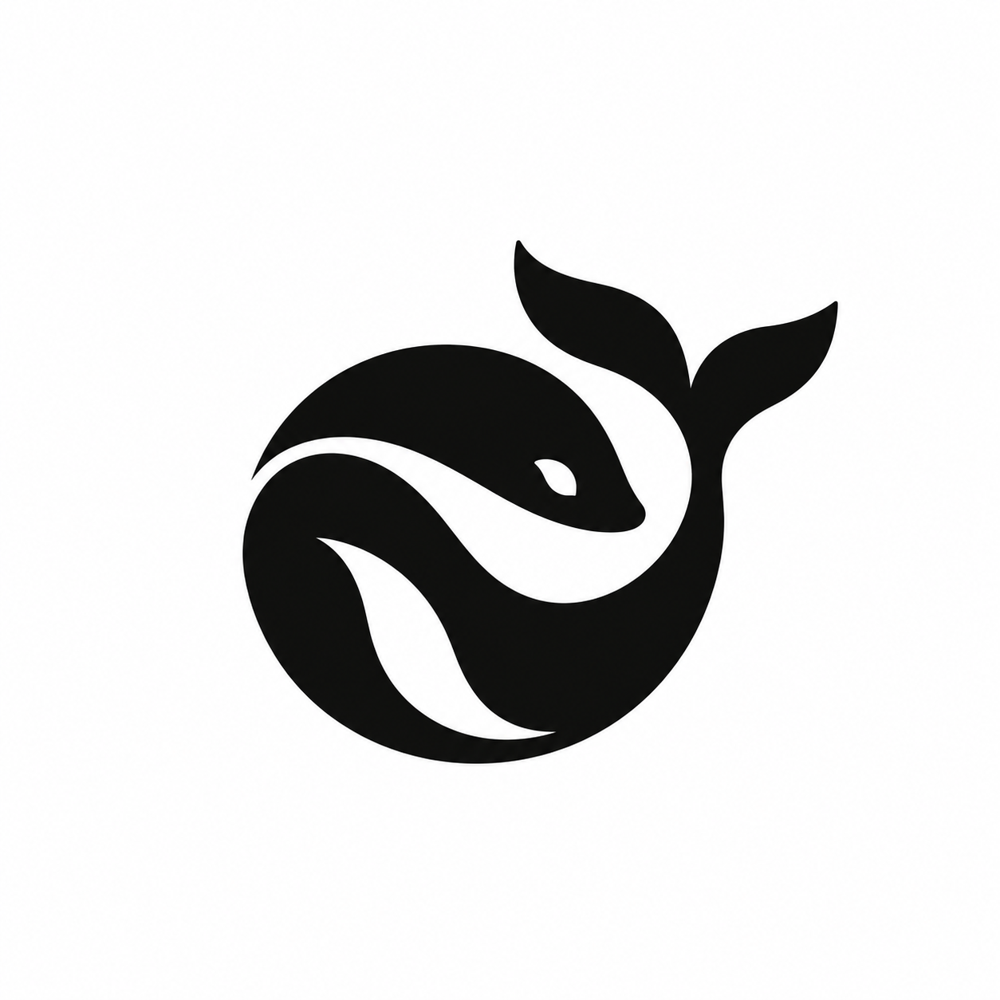

<div align="center">
  <br />
  
  <h1>FreeDeepseekAPI</h1>

  <p><strong>DeepSeek for free. No subscriptions. No API bills. No middlemen.</strong></p>

  <p>
    Private, powerful, and ready wherever you work.<br />
    Use it as much as you want, on your own terms.
  </p>

  <p>
    <a href="https://github.com/dekrezz/FreeDeepseekAPI/stargazers"></a>
    <a href="https://github.com/dekrezz/FreeDeepseekAPI/network/members"></a>
    
    
    
    
    
    
    
  </p>

  <p>
    <a href="#what-it-is">What it is</a> ·
    <a href="#quick-start">Quick start</a> ·
    <a href="#integrations">Integrations</a> ·
    <a href="#api">API</a> ·
    <a href="#container">Container</a> ·
    <a href="#documentation">Docs</a>
  </p>

  <p>
    <strong>English</strong> ·
    <a href="README.ru.md">Русский</a> ·
    <a href="README.zh.md">简体中文</a>
  </p>
</div>

---

## What it is

FreeDeepseekAPI turns an authenticated [chat.deepseek.com](https://chat.deepseek.com) session into local OpenAI Chat Completions, OpenAI Responses, and Anthropic Messages endpoints.

It supports streaming, tool calls, image input, DeepThink, Web Search, sticky agent sessions, and multiple DeepSeek accounts. Everything runs locally; credentials stay in local auth files.

## Quick start

```bash
npm run auth
npm start
```

The server starts at `http://127.0.0.1:9655`.

```bash
curl http://127.0.0.1:9655/v1/chat/completions \
  -H 'Content-Type: application/json' \
  -H 'x-agent-session: worker-a' \
  -d '{
    "model": "deepseek-v4-flash",
    "messages": [{"role": "user", "content": "Hello"}]
  }'
```

## Integrations

Configure all supported coding agents in one command:

```bash
npm run setup:agents
```

DeepSeek is added as an opt-in provider/profile. Existing Claude, GPT, and other default models are not replaced.

<table>
  <tr>
    <td align="center"><strong>Claude Code</strong><br /><sub>Anthropic Messages</sub></td>
    <td align="center"><strong>Codex</strong><br /><sub>Responses + images</sub></td>
    <td align="center"><strong>OpenCode</strong><br /><sub>Image attachments</sub></td>
  </tr>
  <tr>
    <td align="center"><strong>Hermes</strong><br /><sub>Custom provider</sub></td>
    <td align="center"><strong>OpenClaw</strong><br /><sub>Chat Completions</sub></td>
    <td align="center"><strong>Cursor</strong><br /><sub>OpenAI Base URL</sub></td>
  </tr>
</table>

Configuration templates are available in [`integrations/`](integrations/). See the [agent setup guide](docs/agents.md) for paths and options.

## API

| Endpoint | Protocol |
|---|---|
| `POST /v1/chat/completions` | OpenAI Chat Completions |
| `POST /v1/responses` | OpenAI Responses |
| `POST /v1/messages` | Anthropic Messages |
| `GET /v1/models` | Model discovery |
| `GET /health` · `GET /readyz` | Health and readiness |

Image input works through OpenAI `image_url` / `input_image` and Anthropic `image` blocks. PNG, JPEG, WebP, and GIF are supported as base64 data URLs or public HTTPS URLs.

Full reference: [HTTP API](docs/api.md).

## Models

DeepSeek Web currently exposes one model: **DeepSeek-V4.1-Flash**.

| Model ID | Behavior |
|---|---|
| `deepseek-v4-flash` · `deepseek-flash` | V4.1-Flash |
| `…-thinking` | Enables DeepThink |
| `…-search` | Enables Web Search |

Instant, Expert, and Pro are no longer separate Web models. See [model aliases and capabilities](docs/models.md).

## Multiple accounts

One DeepSeek Web account must not run two chats concurrently. For parallel clients, place 2–3 auth files in `accounts/` and give every client a unique `x-agent-session`.

The proxy keeps each agent on a sticky account. A second chat waits for that login instead of overlapping Web requests. The standing system prompt is sent once per remote session, not on every agent turn.

## Container

```bash
podman build -t free-deepseek-api -f Containerfile .
podman run --rm \
  --publish 127.0.0.1:9655:9655 \
  --secret free-deepseek-auth,type=mount,target=/run/secrets/deepseek-auth.json,mode=0400 \
  --secret free-deepseek-proxy-key,type=mount,target=/run/secrets/proxy-api-key,mode=0400 \
  --read-only \
  --cap-drop=ALL \
  --security-opt=no-new-privileges \
  free-deepseek-api
```

## Documentation

- [Authentication](docs/auth.md)
- [Agent setup](docs/agents.md)
- [Models](docs/models.md)
- [HTTP API](docs/api.md)

## Stars

<a href="https://github.com/dekrezz/FreeDeepseekAPI/stargazers">
  
</a>

## License

MIT
