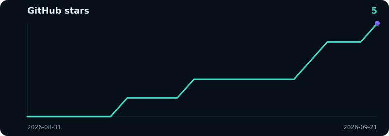

<div align="center">

# FreeDeepseekAPI

Локальный прокси OpenAI / Anthropic / Responses над [chat.deepseek.com](https://chat.deepseek.com).  
Web-логин, без платного API-ключа. **2–3 аккаунта** для параллельных клиентов.

[English](README.md) · **Русский** · [简体中文](README.zh.md)

<p>
  <a href="https://github.com/dekrezz/FreeDeepseekAPI/stargazers"></a>
  <a href="https://github.com/dekrezz/FreeDeepseekAPI/network/members"></a>
  
  
</p>

<p>
  <a href="docs/ru/README.md">Документация</a> ·
  <a href="docs/ru/models.md">Модели</a> ·
  <a href="docs/ru/agents.md">Агенты</a> ·
  <a href="docs/ru/auth.md">Авторизация</a> ·
  <a href="docs/api.md">API</a>
</p>

</div>

## Старт

```bash
npm run auth
npm start
```

```bash
curl http://127.0.0.1:9655/v1/chat/completions \
  -H 'Content-Type: application/json' \
  -d '{"model":"deepseek-v4-flash","messages":[{"role":"user","content":"ping"}]}'
```

## Модели

На Web только **DeepSeek-V4.1-Flash** (Instant / Expert / Pro убраны). [Таблица →](docs/ru/models.md)

| ID | Web |
|---|---|
| [`deepseek-v4-flash`](docs/ru/models.md) / `deepseek-flash` | V4.1-Flash |
| `…-thinking` / `…-search` | DeepThink / Search |

## Агенты одним нажатием

[Как устроено →](docs/ru/agents.md)

```bash
npm run setup:agents
```

<table>
<tr>
<td align="center"><a href="docs/ru/agents.md"><b>Claude Code</b></a></td>
<td align="center"><a href="docs/ru/agents.md"><b>Codex</b></a></td>
<td align="center"><a href="docs/ru/agents.md"><b>OpenCode</b></a></td>
<td align="center"><a href="docs/ru/agents.md"><b>Hermes</b></a></td>
<td align="center"><a href="docs/ru/agents.md"><b>OpenClaw</b></a></td>
<td align="center"><a href="docs/ru/agents.md"><b>Cursor</b></a></td>
</tr>
</table>

Шаблоны: [`integrations/`](integrations/).

## Несколько аккаунтов

Один Web-логин DeepSeek не ведёт два чата сразу. Два агента или две сессии OpenCode — положите 2–3 файла в `accounts/` и дайте каждому клиенту свой `x-agent-session`:

```bash
mkdir -p accounts
npm run auth:import -- --input ~/Downloads/deepseek-auth.json --output ./accounts/worker-2.json
```

Прокси сам берёт свободный логин. Привязать конкретный аккаунт к клиенту нельзя. Второй чат на том же логине ждёт в очереди. Подробности: [Авторизация](docs/ru/auth.md).

## Документация

| Гайд | |
|---|---|
| [Модели](docs/ru/models.md) | V4.1-Flash |
| [Агенты](docs/ru/agents.md) | one-click |
| [Авторизация](docs/ru/auth.md) | несколько Web-логинов |
| [HTTP API](docs/api.md) | пул, очередь, env |

## Звёзды

<p>
  <a href="https://github.com/dekrezz/FreeDeepseekAPI/stargazers"></a>
</p>

<a href="https://github.com/dekrezz/FreeDeepseekAPI/stargazers">
  
</a>
